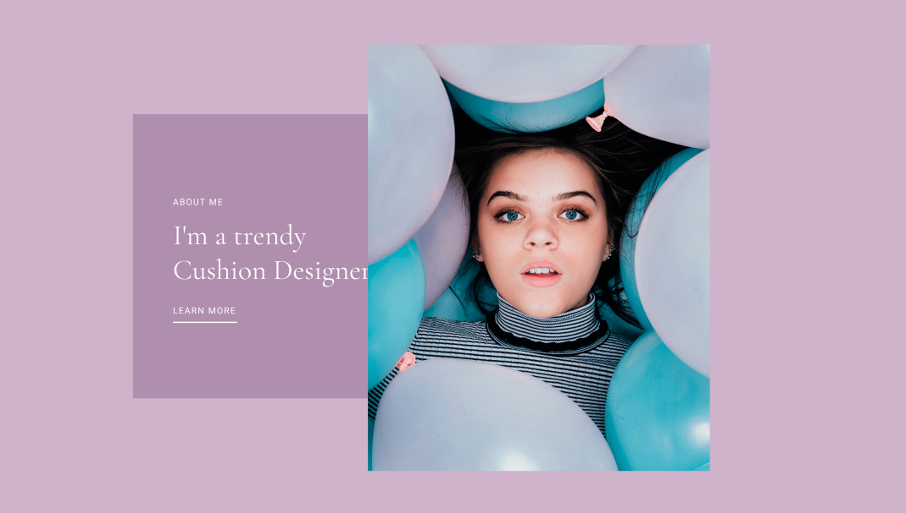

# web
# Человек
# .head .head__eyes .head__eyes--color-blue
# .hands .hands__fingers .hands__fingers--tattoo
# .legs .legs__hair .legs__hair--exist
# Хедэр -> `header.header>.container>img+nav.nav>ul.nav__list>li.nav__item*5>a.nav__link` 

# Форма ->  `section.section.section--bg>.container>(ul.info>(li.info__item*2>p.info__title+p.info__text)+li.info__item>p.info__title+p.info__text*3)+form.form__info>p.form__title+label*5+input.form__item*5+button.form__button`

# Карточка ->  `.card>img.card__img+p.card__title+p.card__price`

# Доп.блок -> `section.about.about--bg>.container>(ul.about__info>(li*2>p.about__title+p.about__subtitle)+li>a.about__link)+img.about__img`
